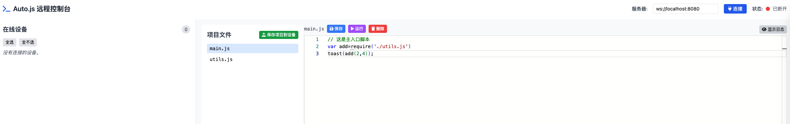
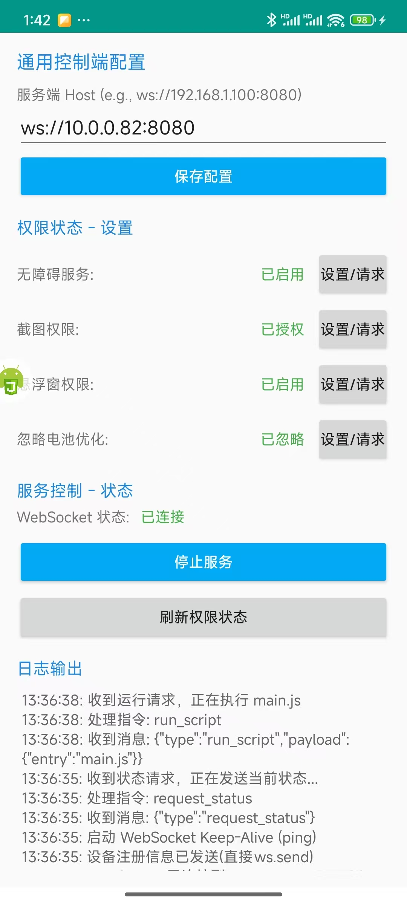

# Auto.js 远程控制台

## 项目简介

本项目是一个基于 WebSocket 的 Auto.js 远程控制与管理平台，适用于需要批量远程管理、监控和下发脚本任务到多台 Android 设备的场景。项目包含服务端（Node.js + Web 管理界面）和客户端（Auto.js 脚本）两部分，支持设备状态实时展示、日志收集、远程脚本下发与执行等功能。设备信息支持持久化存储（Prisma + SQLite）。

<div align="center">
  
  <br/>
  <em>Web 管理台界面</em>
  <br/><br/>
  
  <br/>
  <em>Android 客户端界面</em>
</div>

## 主要功能

- **多设备在线管理**：支持多台 Android 设备同时在线，实时显示设备状态。
- **设备信息与权限检测**：展示设备品牌、型号、系统版本、电量、内存、权限（无障碍、悬浮窗、截图、忽略电池优化）等详细信息。
- **日志收集与查看**：实时收集并展示每台设备的日志输出，支持清空、筛选。
- **远程脚本下发与执行**：可通过 Web 管理台向单台/多台/所有设备下发并远程执行任意 JavaScript 脚本。
- **权限一键跳转与检测**：客户端支持一键跳转系统设置页面，便于快速授予必要权限。
- **安全机制**：支持 WebSocket 心跳保活，断线自动重连，脚本执行结果回传。
- **断线自动重连**：前端与服务端、客户端与服务端均支持断线后自动重连，提升稳定性。
- **设备信息持久化**：所有设备上线、下线、信息变更均自动同步到 SQLite 数据库，支持历史设备管理。

## 系统架构

```
+-------------------+         WebSocket         +-------------------+
|   管理员浏览器    | <--------------------->  |    Node.js 服务端  |
| (src/index.html)  |                         |   (src/index.js)   |
+-------------------+                         +-------------------+
                                                        |
                                                        | WebSocket
                                                        |
                                              +-------------------+
                                              |   Android 客户端   |
                                              | (AutoJs/main.js)  |
                                              +-------------------+
```

- **服务端**：基于 Node.js，负责设备连接管理、消息转发、日志收集、脚本下发、设备信息持久化等。
- **Web 管理台**：基于 HTML+JS+TailwindCSS，提供设备列表、日志、脚本下发等可视化操作界面。
- **Android 客户端**：Auto.js 脚本，负责与服务端通信、权限检测、日志上报、脚本执行。

## 目录结构

```
├── AutoJs/
│   ├── main.js           # Auto.js 安卓客户端脚本
│   ├── test.js           # 权限测试/示例脚本
│   └── project.json      # Auto.js 项目配置
├── src/
│   ├── index.js          # Node.js WebSocket 服务端（含数据库持久化）
│   └── index.html        # 管理员 Web 控制台（前端页面）
├── prisma/
│   └── schema.prisma     # Prisma 数据库模型定义
├── generated/prisma/     # Prisma 生成的客户端代码
├── package.json          # Node.js 依赖配置
├── pnpm-lock.yaml        # pnpm 锁定文件
├── .env                  # 数据库等环境变量配置
├── screenshot/           # 项目截图
└── README.md             # 项目说明文档
```

## 部署与使用

### 1. 服务端部署

1. 安装 Node.js 环境。
2. 安装依赖：
   ```bash
   pnpm install
   # 或 npm install
   ```
3. 初始化数据库（如首次使用或模型有变更）：
   ```bash
   npx prisma migrate dev --name init
   ```
4. 启动服务端：
   ```bash
   node src/index.js
   ```
   默认监听 8080 端口。
5. 打开浏览器访问 [http://localhost:8080/](http://localhost:8080/)，即可进入 Web 管理台（建议用 Chrome）。

### 2. 客户端部署（Android 端）

1. 安装 [Auto.js](https://autojs.org/)（推荐 4.1.1 Alpha 版本及以上）。
2. 将 `AutoJs/main.js` 脚本导入 Auto.js 并运行。
3. 在客户端 UI 中配置服务端 WebSocket 地址（如：`ws://服务器IP:8080`），并授予必要权限（无障碍、悬浮窗、截图、忽略电池优化）。
4. 启动服务，等待设备上线。

### 3. 远程控制与管理

- 在 Web 管理台可实时查看所有在线设备、设备信息、日志。
- 可选择单台/多台/全部设备，输入 JS 脚本并远程下发执行。
- 支持日志实时回传与查看，脚本执行结果会反馈到前端。
- 所有设备信息、上线/下线历史均自动保存到本地 SQLite 数据库。
- **注意：前端与 Android 客户端之间的所有通信均需通过服务端中转，前端与客户端之间没有直接 WebSocket 连接。**

## 数据库与持久化

- 数据库采用 SQLite，模型定义见 `prisma/schema.prisma`。
- 通过 Prisma ORM 自动管理，所有设备上线、下线、信息变更均自动 upsert 到数据库。
- 可通过 Prisma Studio (`npx prisma studio`) 可视化管理数据。

## 注意事项

- **安全风险**：远程下发并执行任意脚本存在极高安全风险，请确保服务端和网络环境安全，避免暴露在公网。
- **权限要求**：客户端需授予无障碍、悬浮窗、截图、忽略电池优化等权限，否则部分功能不可用。
- **兼容性**：Auto.js 需 4.1.1 Alpha 及以上版本，部分权限跳转在不同品牌设备上可能略有差异。
- **日志与隐私**：日志和设备信息仅用于远程管理，请妥善保管数据，避免泄露。

## 适用场景

- 批量自动化测试、远程脚本分发、设备状态监控、企业级设备管理等。

## 贡献与许可

- 本项目遵循 ISC 协议，欢迎二次开发与贡献。

---

如有问题或建议，欢迎 issue 反馈。
